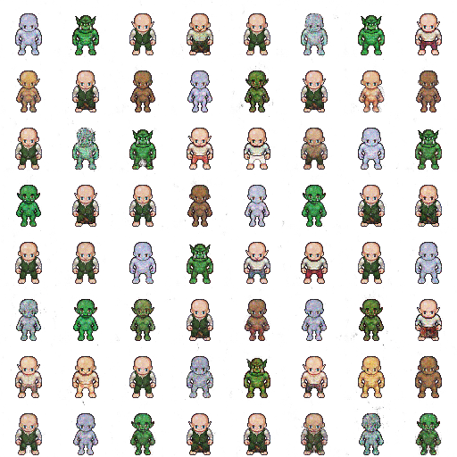

# AAA (Author, Artist, Animator) Conditional Convolutional Generative Adversarial Network

This is a work in progress

The idea is to create three systems which work together to create assets procedurally for games.

Here's a sample output from the current training.

By using a Conditional CGAN, the network can generate images based on inputs and a random noise vector.

More to come...

## Requirements
- Python 3.x.x
- Tensorflow version 1.6, I haven't included this in requirements, as depending on system specs, you might want the GPU version.