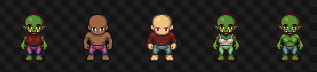
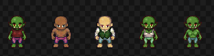
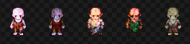
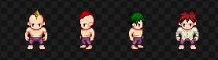
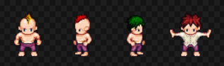

# AAA (Author, Artist, Animator) Conditional Convolutional Generative Adversarial Network

This is a work in progress

The idea is to create three systems which work together to create assets procedurally for games.

Here's a sample output from the previous training.

By using a Conditional CGAN (Called the Artist), the network can generate images based on inputs and a random noise vector.

For example the image below is a real image from the dataset, each aspect of the sprite has a label, i.e. Orc.

By feeding in a conditional vector alongside the noise vector, the network can start to learn the association of that label to a characteristic.

The below image is an example of what the network generates when fed the same labels as the above image.

It's clear that overtime overfitting will occur, i'm currently trying to reduce the dependence on the labels through artificial noise, so the network can learn to make interesting variations. (However, this is still in the works.)

The next part of the pipeline is feeding this generated image into a Conditional CycleGAN (Called the Animator), which takes in a vector specifying an animation and the frame of the animation, as well as the base image of the animation a.k.a frame 0.

The network then learns from the dataset what aspects of the sprite needs to be changed in order to reproduce that frame.

More to come...

This is my first time using Tensorflow and creating/training NN models, so let me know if there's anything that can be improved.

## Requirements
- Python 3.x.x
- Tensorflow version 1.6, I haven't included this in requirements, as depending on system specs, you might want the GPU version.

## Acknowledgements

For my models i've been using existing architectures as inspiration, lots of smarter people have already figured out great models for this.

- https://github.com/carpedm20/DCGAN-tensorflow (Conditional Generator Architecture for the artist)
- https://github.com/affinelayer/pix2pix-tensorflow (Base of Generator Architecture for the animator)
- https://github.com/jguertl/Conditional-DCGAN (The Conditional Discriminator)

The dataset i'm using is based on the site created by this repo: https://github.com/Gaurav0/Universal-LPC-Spritesheet-Character-Generator/tree/cee425fd2f5327ecb18448bc95fd37efa94b49ca
